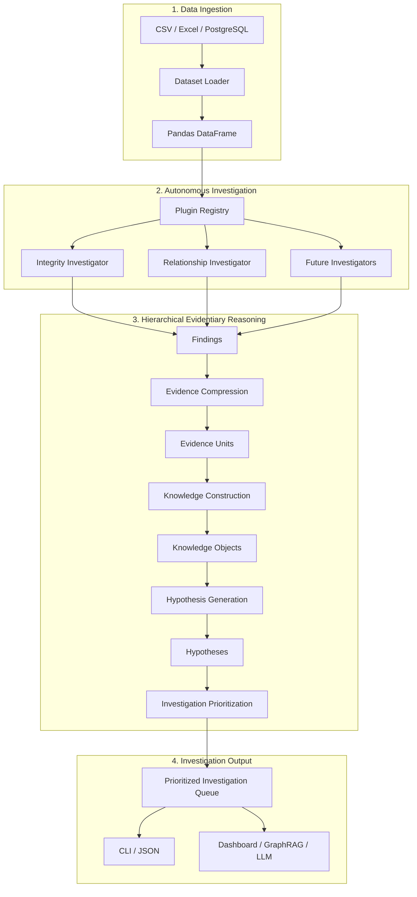
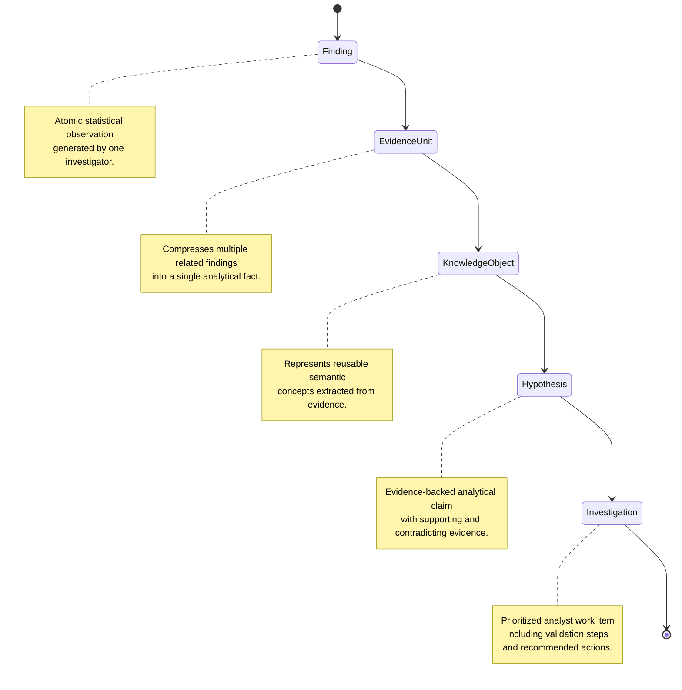

# AI Investigation Intelligence Engine (Phase 1)

[](https://www.python.org/downloads/release/python-3120/)
[](#testing)
[](LICENSE)

An autonomous **Hierarchical Evidentiary Reasoning Framework** for structured dataset investigation.

Unlike traditional Exploratory Data Analysis (EDA) tools that primarily generate descriptive statistics and visual reports, the **AI Investigation Intelligence Engine (AIIE)** automatically discovers statistically significant observations, compresses redundant evidence, constructs semantic knowledge, generates explainable hypotheses, and produces a prioritized queue of investigations before human analysis begins.

Rather than answering:

> **"What statistics exist?"**

the framework attempts to answer:

> **"What deserves investigation, why does it matter, and what should be investigated first?"**

---

# Research Motivation

Modern datasets are becoming increasingly large and structurally complex. Analysts spend considerable time manually exploring data before any meaningful modelling or decision-making begins.

Existing AutoEDA systems excel at **describing** datasets but rarely assist analysts in **reasoning** about them.

The AI Investigation Intelligence Engine addresses this challenge by introducing a hierarchical reasoning framework that progressively transforms statistical observations into explainable investigations.

---

# Research Contributions

The current Phase 1 prototype introduces:

* Hierarchical Evidentiary Reasoning Framework (HERF)
* Autonomous modular investigation architecture
* Explainable evidence compression
* Semantic knowledge construction
* Evidence-backed hypothesis generation
* Explainable investigation prioritization
* Complete provenance tracking across every reasoning layer

---

# Technical Architecture

The framework consists of four major stages.



---

# Hierarchical Evidentiary Reasoning Pipeline

Instead of presenting raw statistical observations directly to analysts, the framework progressively transforms them through multiple abstraction layers.

Each layer reduces redundancy while increasing semantic meaning.



---

# Abstraction Layers

| Layer             | Model             | Responsibility                                                                                    |
| ----------------- | ----------------- | ------------------------------------------------------------------------------------------------- |
| **Finding**       | `Finding`         | Immutable statistical observation generated by one investigator.                                  |
| **Evidence**      | `EvidenceUnit`    | Compresses redundant findings into a single analytical fact while preserving provenance.          |
| **Knowledge**     | `KnowledgeObject` | Represents reusable semantic concepts synthesized from evidence units.                            |
| **Hypothesis**    | `Hypothesis`      | Evidence-backed analytical explanation containing supporting, contradicting and unknown evidence. |
| **Investigation** | `Investigation`   | Final prioritized analyst task generated from one or more hypotheses.                             |

---

# Autonomous Investigators

Investigators are independent analytical modules automatically discovered through the plugin registry.

Each investigator is responsible for discovering observations within a specific analytical domain.

## Phase 1

| Investigator                  | Responsibility                                                                                        |
| ----------------------------- | ----------------------------------------------------------------------------------------------------- |
| **Integrity Investigator**    | Structural integrity, missing values, duplicates, identifiers, datatypes, cardinality, dataset health |
| **Relationship Investigator** | Pearson, Spearman, Mutual Information, multicollinearity, feature communities, dependency analysis    |

## Planned (Phase 2)

* Distribution Investigator
* Anomaly Investigator
* Cluster Investigator
* Feature Importance Investigator
* Drift Investigator

---

# Why This Is Different From Traditional AutoEDA

| Traditional AutoEDA              | AI Investigation Intelligence Engine         |
| -------------------------------- | -------------------------------------------- |
| Reports descriptive statistics   | Produces explainable investigations          |
| Flat statistical summaries       | Hierarchical reasoning pipeline              |
| User manually discovers insights | Engine proactively identifies investigations |
| Independent findings             | Evidence compression and synthesis           |
| Descriptive analytics            | Explainable analytical hypotheses            |
| Manual prioritization            | Automated investigation ranking              |

---

# Core Design Principles

## Explainability

Every investigation is fully traceable.

```text
Investigation
      ↓
Hypothesis
      ↓
Knowledge Object
      ↓
Evidence Unit
      ↓
Finding
      ↓
Investigator
```

---

## Deterministic Reasoning

The reasoning pipeline is entirely deterministic.

No Large Language Models participate in evidence generation, reasoning, or prioritization.

---

## Provenance Preservation

Every reasoning layer preserves complete lineage.

No abstraction loses its originating statistical observations.

---

## Progressive Abstraction

Each reasoning stage transforms low-level observations into higher-level analytical knowledge.

```text
Raw Dataset

↓

Statistical Observations

↓

Findings

↓

Evidence

↓

Knowledge

↓

Hypotheses

↓

Investigations
```

---

## Modular Extensibility

New investigators can be added without modifying the reasoning pipeline.

Each investigator contributes independent observations while remaining fully decoupled from downstream reasoning.

---

# Installation

```bash
git clone https://github.com/username/investigation-engine.git

cd investigation-engine

python3.12 -m venv .venv

source .venv/bin/activate

pip install -e ".[dev]"
```

---

# Configuration

The framework uses hierarchical **Pydantic Settings**.

Configuration may be provided through `.env` files or environment variables prefixed with `IE_`.

```ini
IE_LOG_LEVEL=INFO

IE_MAX_ROWS_SAMPLE=500000

IE_INTEGRITY__MISSING_MEDIUM_THRESHOLD=0.10

IE_INTEGRITY__NEAR_CONSTANT_DOMINANCE_THRESHOLD=0.95

IE_RELATIONSHIP__PEARSON_THRESHOLD=0.80

IE_RELATIONSHIP__VIF_HIGH_THRESHOLD=5.0
```

---

# CLI Usage

```bash
# Display engine information
investigation-engine info

# Display JSON schemas
investigation-engine schema

# Investigate a dataset
investigation-engine investigate data/data.xlsx

# Verbose reasoning output
investigation-engine investigate data/data.xlsx --verbose

# Export machine-readable results
investigation-engine investigate data/data.xlsx --output results.json
```

---

# Testing

Run the complete validation suite:

```bash
pytest tests/ -v
```

Current test coverage includes:

* Plugin discovery
* Investigator registration
* Integrity Investigator
* Relationship Investigator
* Evidence Compression
* Knowledge Construction
* Hypothesis Generation
* Investigation Prioritization
* End-to-end reasoning pipeline

---

# Phase 1 Status

## Infrastructure

* Python 3.12 Architecture
* Plugin Framework
* CLI
* Configuration Management
* Logging
* Unit Testing

## Investigators

* Integrity Investigator
* Relationship Investigator

## Hierarchical Evidentiary Reasoning

* Findings
* Evidence Compression
* Evidence Units
* Knowledge Construction
* Knowledge Objects
* Hypothesis Generation
* Investigation Prioritization
* Investigation Queue

---

# Roadmap

## Phase 2

* Distribution Investigator
* Anomaly Investigator
* Cluster Investigator
* Feature Importance Investigator
* Drift Investigator
* Improved Evidence Compression Algorithms
* Semantic Knowledge Construction
* Graph-based Reasoning
* Analyst Feedback Integration

## Phase 3

* GraphRAG Integration
* Natural Language Investigation Assistant
* Interactive Analyst Dashboard
* Cross-Dataset Knowledge Graph
* Adaptive Investigation Prioritization

---

# License

This project is released under the MIT License.
