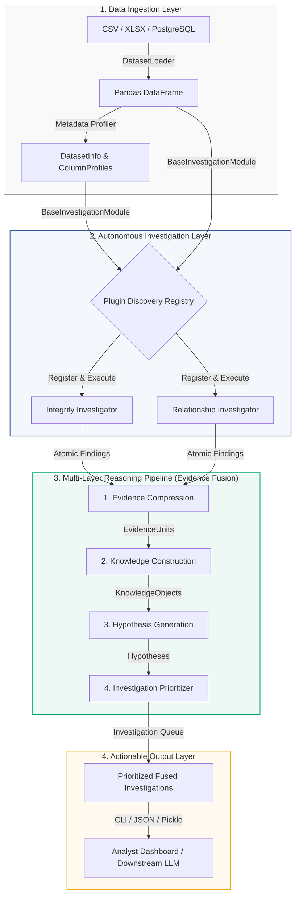
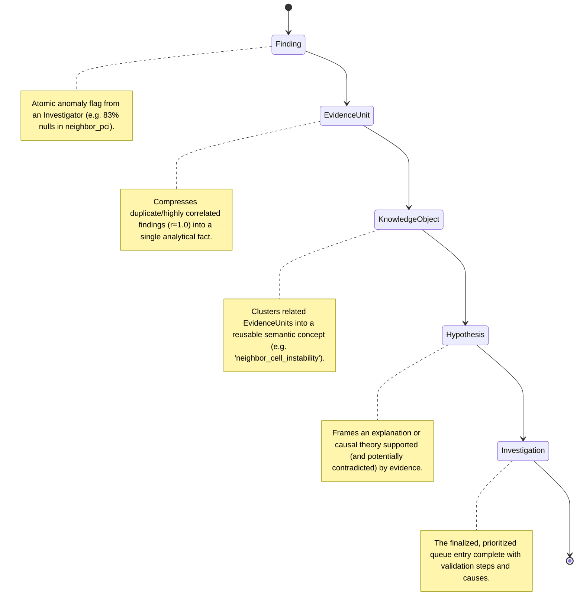

# AI Investigation Intelligence Engine (Phase 1)

[](https://www.python.org/downloads/release/python-3120/)
[](#testing)
[](LICENSE)

An autonomous, evidence-driven analytical engine designed to automate the exploratory and data-profiling phases analysts perform before decision-making. 

Traditional Exploratory Data Analysis (EDA) tools (e.g., Pandas Profiling, Sweetviz, Tableau) are *descriptive*; they generate massive statistical reports but leave the task of identifying abnormalities to human experts. The **AI Investigation Intelligence Engine** shifts this paradigm by proactively discovering structural anomalies, statistical relationships, and multicollinearity, fusing them into a prioritized list of cohesive **Investigations** using a multi-layer reasoning pipeline.

---

## Technical Architecture & Workflow

The engine functions as a unified pipeline where raw data is ingested, analyzed by domain-specific investigators, converted to atomic findings, synthesized through successive abstraction layers, and finally prioritized for analyst review.

### Architecture Flow Diagram



---

## Detailed reasoning Pipeline

The core differentiator of the engine is its post-investigation reasoning workflow, which compresses redundant information, extracts concepts, frames hypotheses, and calculates priorities.



### Abstraction Layers & Data Models

| Layer | Model | Responsibility | Key Attributes |
| :--- | :--- | :--- | :--- |
| **Findings** | `Finding` | Represents raw, reproducible statistical anomalies detected directly on columns or rows. | `id`, `module`, `title`, `evidence`, `severity`, `confidence`, `affected_columns`, `metadata` |
| **Evidence** | `EvidenceUnit` | Groups and compresses highly correlated or redundant findings (e.g., matching missingness patterns) into unified facts. | `evidence_id`, `category`, `supporting_findings`, `strength`, `provenance`, `affected_columns` |
| **Knowledge** | `KnowledgeObject` | Synthesizes abstract semantic concepts by grouping evidence units sharing feature families or logical relationships. | `knowledge_id`, `concept`, `description`, `supporting_evidence`, `related_concepts`, `provenance` |
| **Hypothesis** | `Hypothesis` | Constructs a falsifiable statement supported by evidence, detailing plauisble causes and validation steps. | `hypothesis_id`, `title`, `statement`, `supporting_evidence`, `contradicting_evidence`, `plausible_causes` |
| **Investigation** | `Investigation` | The final structured reasoning container presented to the analyst, prioritized by weighted importance. | `investigation_id`, `title`, `summary`, `priority`, `recommended_next_steps`, `priority_explanation` |

---

## Autonomous Investigators

The engine automatically runs all investigators registered via the `@register_module` decorator. In Phase 1, two complete investigators are active:

### 1. Integrity Investigator (`modules/integrity.py`)
Responsible for assessing the structural health of the dataset. It runs 10 specific checks:
* **Missing Value Investigation**: Identifies column null ratios and flags completely empty columns.
* **Duplicate Row Investigation**: Performs vectorized duplicate checks, flagging exact duplicates.
* **Duplicate Feature Investigation**: Groups columns with identical values using fast hash fingerprints and strict equality.
* **Identifier Investigation**: Detects primary key candidates and highlights duplicates or null records in them.
* **Constant Feature Investigation**: Detects columns with zero variance.
* **Near-Constant Feature Investigation**: Flags columns dominated by a single value (e.g., >95% dominance).
* **Datatype Integrity**: Identifies numeric columns stored as strings and mixed data types in string/object columns.
* **Cardinality Investigation**: Flags columns with abnormally high or low cardinality.
* **Missingness Relationships**: Computes correlations between column missingness patterns (e.g., columns missing together).
* **Structural Health Score**: Computes a weighted composite score (0–100) representing structural health.

### 2. Relationship Investigator (`modules/relationship.py`)
Responsible for discovering statistically significant feature-to-feature and feature-to-target dependencies:
* **Linear & Monotonic Correlations**: Computes Pearson and Spearman correlation matrices, flagging relationships exceeding thresholds.
* **Nonlinear Dependence (Mutual Information)**: Evaluates pairwise mutual information to flag nonlinear dependencies that linear correlations miss.
* **Target Dependency**: Detects target columns heuristically and runs classification/regression mutual information to identify predictive feature importances.
* **Multicollinearity**: Computes Variance Inflation Factors (VIF) to flag redundant predictors that destabilize models.
* **Feature Communities & Groups**: Uses NetworkX to cluster redundant columns and community sub-systems.

---

## Setup & Installation

The engine requires Python 3.12+.

```bash
# Clone the repository
git clone https://github.com/username/investigation-engine.git
cd investigation-engine

# Create virtual environment and install package in editable mode with dev dependencies
python -m venv .venv
source .venv/bin/activate
pip install -e ".[dev]"
```

---

## Configuration

All statistical limits and severity boundaries are configured hierarchically using Pydantic Settings. Settings can be defined in a `.env` file or overridden using environment variables prefixed with `IE_`.

```ini
# Example .env Configuration
IE_LOG_LEVEL=INFO
IE_MAX_ROWS_SAMPLE=500000

# Integrity Thresholds
IE_INTEGRITY__MISSING_MEDIUM_THRESHOLD=0.10
IE_INTEGRITY__NEAR_CONSTANT_DOMINANCE_THRESHOLD=0.95

# Relationship Thresholds
IE_RELATIONSHIP__PEARSON_THRESHOLD=0.80
IE_RELATIONSHIP__VIF_HIGH_THRESHOLD=5.0
```

---

## CLI Usage

The Typer-based CLI acts as the primary interface for running investigations.

```bash
# General help
investigation-engine --help

# List registered investigators and settings
investigation-engine info

# View the universal Finding JSON schema
investigation-engine schema

# Run investigation on a dataset (returns high-level summary)
investigation-engine investigate data/data.xlsx

# Run investigation with detailed tables of fused investigations and structural health
investigation-engine investigate data/data.xlsx --verbose

# Write machine-readable output results to a JSON file
investigation-engine investigate data/data.xlsx --output results.json
```

---

## Testing

Verify the mathematical logic and reasoning pipeline with the unit test suite:

```bash
pytest tests/ -v
```
The test suite covers:
* Plugin registration and auto-discovery.
* Integrity validations (nulls, duplicates, constant columns, mixed types, cardinality).
* Relationship tests (Pearson, Spearman, Mutual Information, VIF, network communities).
* Evidence compression, concept constructor, hypothesis generators, and priority ranking.
